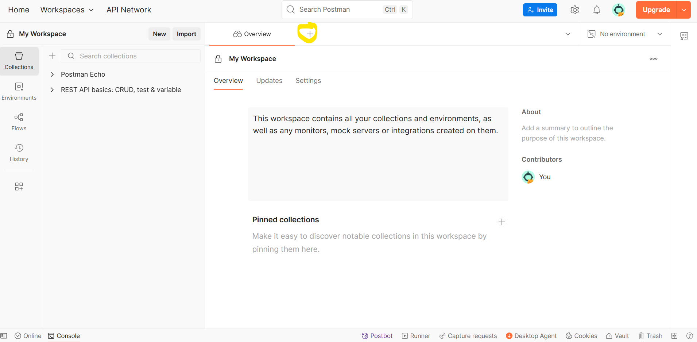
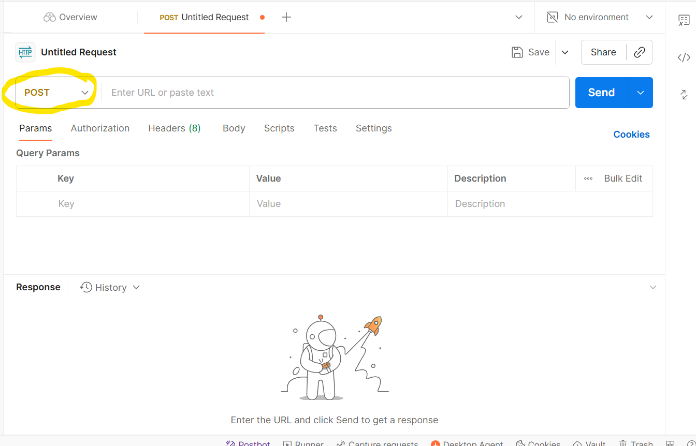

# Express API

## Learning Goals

- [ ] **Understand the request response cycle**
- [ ] **Recall HTTP Requests and VERBS**
- [ ] **Configure an express server**
- [ ] **Configure an express cors**
- [ ] **Create a GET Route that returns data to the front end**
- [ ] **Create a POST route that receives data from request parameters**

## The Request-Response Cycle

Client-server architecture is widely used in modern software development. In this model, a client application, such as a web browser on a phone, sends a request to a backend server. The server processes the request and sends a response back to the client.

## HTTP Requests (Hypertext Transfer Protocol)

HTTP is a protocol for transferring data over the web in a client–server model. It’s language-agnostic, meaning it works with many different programming languages.

Think of it like sending a letter back and forth between your computer and a server. Just as a letter has stamps, an address, and a return address, an HTTP request has key parts that help it do its job. Here are some of the most important:

- **Request URL**: The “address” of the request—where it’s being sent.
- **HTTP headers**: Extra information (metadata) that accompanies the request or response.
- **HTTP methods (verbs)**: Indicate the purpose of the request, whether you’re reading data, creating new data, updating existing data, or deleting data.
- **HTTP status codes**: Show the outcome of the request—whether it succeeded or failed. A common example you may already know is **404**, which means the requested resource was not found.

Find more info on [HTTP in the MDN docs](https://developer.mozilla.org/en-US/docs/Web/HTTP/Guides/Overview)

## HTTP Method

As mentioned above, the HTTP method determines what action the request is asking the server to perform.

| HTTP Verb | Description                                  | Example Use Case                               |
| --------- | -------------------------------------------- | ---------------------------------------------- |
| GET       | Retrieve data from the server                | Fetching a list of restaurants                 |
| POST      | Send data to the server to create a resource | Adding a new restaurant to the database        |
| PUT       | Update an existing resource entirely         | Updating the details of an existing restaurant |
| PATCH     | Partially update an existing resource        | Changing a restaurant's hours of operation     |
| DELETE    | Remove a resource from the server            | Deleting a restaurant from the database        |

## JSON

JavaScript Object Notation (JSON) is the format used to transfer data across the web.  
It’s technically plain text, which makes it lightweight and perfect for sending data quickly.

JSON looks very similar to JavaScript object literals, but **all keys must be strings**.

```
{"name": "rose", "age": 14}
```

## Lab Deliverables

1. Configure express

- Import `restaurants` from `data.js`.
- Invoke `express` and assign it to a variable called `app`.
- Create a variable called `port` and set it to `3000`.
- Call `app.use` and pass it `cors()` to enable cross-origin requests.
  - CORS is a security feature that typically prevents communication between servers and clients on different domains. Here, we’re allowing this communication.
- Call `app.use` and pass it `express.json()`. This middleware parses incoming JSON requests and converts them into JavaScript objects.
- Leave some blank space for additional code to be added later.
- Call `app.listen`, passing the `port` variable and a callback function.
- In the callback, create a `console.log` that says `Server running on http://localhost:${port}`.

<details>
  <summary>Click Here to view solution</summary>

```

import express  from 'express'
import cors from 'cors'
import {restaurants} from './data.js'
const app = express();
const port = 3000;
app.use(cors());
app.use(express.json());


//Leave space here for more code


app.listen(port, () => {
  console.log(`Server running on http://localhost:${port}`);
});


```

</details>

2. Create a GET request that will send data to the server.

- Call `app.get` below `app.use(express.json());`, passing it the string `'/restaurants'` and a callback function with parameters `req` and `res`.
- Inside the callback function, invoke and return `res.json()`, passing the `restaurants` variable as a parameter.
- Run the server using `npm run server`. This script is already set up in `package.json` and will start the server for you.
- We are using `nodemon`, which automatically restarts the server when changes are made. However, if you encounter bugs, you may need to stop the server manually using `cmd + c` (on macOS) or `ctrl + c` (on Windows/Linux).
- Run the live server and check the browser's developer console for the data.
- **Note**: The src/index.js file contains the code for making requests to the server. When a response is received, it logs the data to the console.

<details>
  <summary>Click Here to view solution</summary>

```
//This will go in the space you left in the middle of your code.

app.get('/restaurants', (req, res) => {
  res.json(restaurants);
});


```

</details>

3. Create a POST request that receives data from the client

- Invoke `app.post`, passing it the path `'/restaurants'` and a callback function with parameters `req` and `res`.
- Inside the callback, create a variable called `newRestaurant` and set it to an object literal. Set the keys of the object to `name`, `address`, `phone`, `cuisine`, `rating`, `hours`, and `menu`. Use the corresponding data from the request body, e.g., `req.body.name`.
- Push `newRestaurant` to the `restaurants` array.
- Invoke `res.status(201)` and chain `.json()`, passing `newRestaurant` as the response.
- Verify your work using Postman.
  
- Navigate to a new workspace and select the pluse button
  
- Click the drop down menu that says GET and select POST
  
- Enter the **Request URL** to your server.
- Select the **Body** tab and choose **raw**.
- Enter a JSON object with keys matching the parameters from your POST request:  
  `name`, `address`, `phone`, `cuisine`, `rating`, `hours`, and `menu`.

<details>
  <summary>Click Here to view solution</summary>

```

app.post('/restaurants', (req, res) => {
  const newRestaurant = {
    id: restaurants.length + 1,
    name: req.body.name,
    address: req.body.address,
    phone: req.body.phone,
    cuisine: req.body.cuisine,
    rating: req.body.rating,
    hours:req.body.hours,
    menu: req.body.menu
  };

  restaurants.push(newRestaurant);
  res.status(201).json(newRestaurant);
});


```

</details>

5. Close down your server by hitting `cmd + c` (on macOS) or `ctrl + c` (on Windows/Linux)

## Submission Instructions

1. Push your code to GitHub.
2. Submit the link to your GitHub repository URL.
